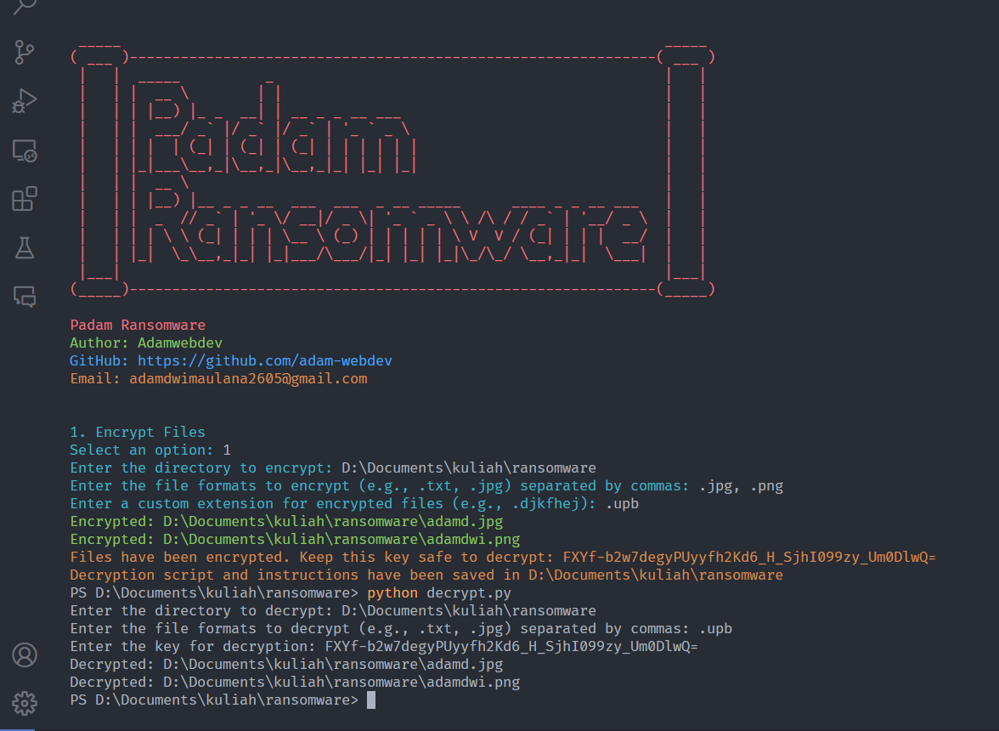

# Welcome
# Padam Ransomware


```
_____                                                                _____
( ___ )--------------------------------------------------------------( ___ )
 |   |                                                                |   |
 |   |  _____          _                                              |   |
 |   | |  __ \        | |                                             |   |
 |   | | |__) |_ _  __| | __ _ _ __ ___                               |   |
 |   | |  ___/ _` |/ _` |/ _` | '_ ` _ \                              |   |
 |   | | |  | (_| | (_| | (_| | | | | | |                             |   |
 |   | |_|___\__,_|\__,_|\__,_|_| |_| |_|                             |   |
 |   | |  __ \                                                        |   |
 |   | | |__) |__ _ _ __  ___  ___  _ __ _____      ____ _ _ __ ___   |   |
 |   | |  _  // _` | '_ \/ __|/ _ \| '_ ` _ \ \ /\ / / _` | '__/ _ \  |   |
 |   | | | \ \ (_| | | | \__ \ (_) | | | | | \ V  V / (_| | | |  __/  |   |
 |   | |_|  \_\__,_|_| |_|___/\___/|_| |_| |_|\_/\_/ \__,_|_|  \___|  |   |
 |___|                                                                |___|
(_____)--------------------------------------------------------------(_____)

```
## Disclaimer


### Ransomware viruses are generally in .exe format, and use a combination of symmetric and asymmetric encryption, making them difficult to overcome without the key.

This script is intended for simulation or educational purposes only. The author does not take any responsibility for any unintended consequences, data loss, or damage resulting from the use of this script. Use this script at your own risk.

**This script should not be used for malicious purposes. Engaging in unauthorized encryption of data, ransomware attacks, or any other form of cybercrime is illegal and punishable by law. The author disclaims any responsibility for misuse of this script.**

## Author


## Overview

This script is designed to encrypt files within a specified directory and its subdirectories. The files are encrypted using the Fernet encryption scheme from the `cryptography` library. Additionally, the script generates a decryption key and a decryption script to help decrypt the encrypted files.

## Requirements

- Python 3.6 or later
- `cryptography` library
- `termcolor` library

You can download Python from [here](https://www.python.org/downloads/).

## Installation

1. Install Python and `pip` if not already installed.
2. Install the required libraries:
    ```sh
    pip install -r requirements.txt
    ```

## Usage

### Encrypt Files

1. Run the `padamransom.py` script:
    ```sh
    python padamransom.py
    ```

2. Follow the instructions to enter the directory you want to encrypt, here you have to be careful, make sure if to test, you are required to create a new folder and put a file either an image in .jpg, .png, .jpeg format or other file formats such as .pdf, .docx, .xlsx etc. to be encrypted, for example, enter the directory `D:\testing` and enter the file format you want to encrypt. You also need to provide a custom extension for the encrypted file.

Example:

3. The script will encrypt all files in the specified directory and its subdirectories that match the given formats.

4. The script will display the encryption key. **Keep this key safe** to decrypt the files later. The key and decryption instructions will also be saved in a file named `decrypt_instructions.txt` in the encrypted directory.

### Decrypt Files

1. Locate the `decrypt.py` script and `decrypt_instructions.txt` file in the encrypted directory.

2. Run the `decrypt.py` script:
 ```sh
 python decrypt.py
 ```
3. Enter the custom extension for encrypted files (e.g., `.ccc`).
4. Follow the prompts to enter the directory you wish to decrypt and the file formats you want to decrypt.


5. Enter the key for decryption.

The files in the specified directory with the custom extension will be decrypted and restored to their original formats.


### Example  Instruction :




## Important Note

- **Backup your data** before running the script. This script will remove the original files after encryption.
- **Do not share your encryption key**. Losing the key means losing access to your encrypted files permanently.

## Author

- Adamwebdev
- GitHub: [https://github.com/adam-webdev](https://github.com/adam-webdev)
- Email: adamdwimaulana2605@gmail.com
