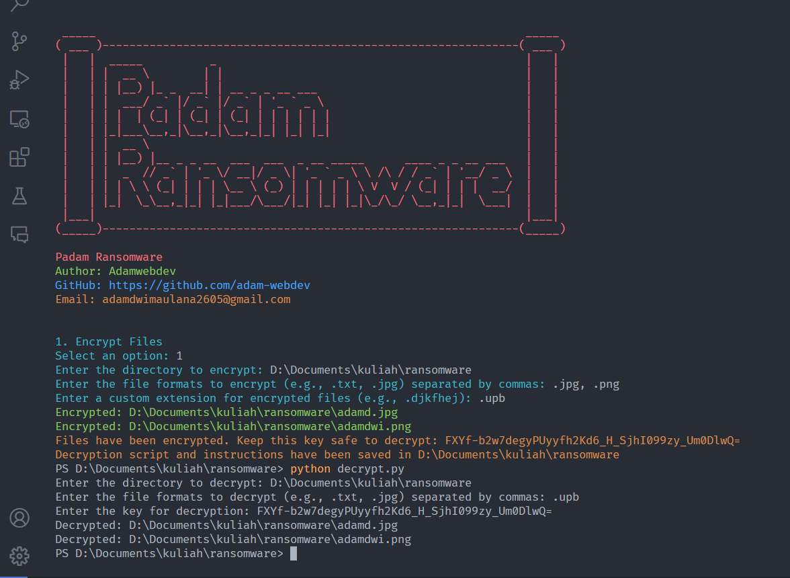

# Selamat Datang
# Padam Ransomware


```
_____                                                                _____
( ___ )--------------------------------------------------------------( ___ )
 |   |                                                                |   |
 |   |  _____          _                                              |   |
 |   | |  __ \        | |                                             |   |
 |   | | |__) |_ _  __| | __ _ _ __ ___                               |   |
 |   | |  ___/ _` |/ _` |/ _` | '_ ` _ \                              |   |
 |   | | |  | (_| | (_| | (_| | | | | | |                             |   |
 |   | |_|___\__,_|\__,_|\__,_|_| |_| |_|                             |   |
 |   | |  __ \                                                        |   |
 |   | | |__) |__ _ _ __  ___  ___  _ __ _____      ____ _ _ __ ___   |   |
 |   | |  _  // _` | '_ \/ __|/ _ \| '_ ` _ \ \ /\ / / _` | '__/ _ \  |   |
 |   | | | \ \ (_| | | | \__ \ (_) | | | | | \ V  V / (_| | | |  __/  |   |
 |   | |_|  \_\__,_|_| |_|___/\___/|_| |_| |_|\_/\_/ \__,_|_|  \___|  |   |
 |___|                                                                |___|
(_____)--------------------------------------------------------------(_____)

```

## Disclaimer

#### Virus ransomware pada umumnya biasanya berformat .exe, dan menggunakan kombinasi enkripsi simetris dan asimetris sehingga virus ini sulit untuk diatasi tanpa kuncinya.

Skrip ini dimaksudkan untuk simulasi atau tujuan pendidikan saja. Penulis tidak bertanggung jawab atas konsekuensi yang tidak diinginkan, kehilangan data, atau kerusakan yang diakibatkan oleh penggunaan skrip ini. Gunakan skrip ini dengan risiko Anda sendiri.

**Skrip ini tidak boleh digunakan untuk tujuan jahat. Melakukan enkripsi data yang tidak sah, serangan ransomware, atau bentuk kejahatan siber lainnya adalah ilegal dan dapat dihukum oleh hukum. Penulis menolak tanggung jawab atas penyalahgunaan skrip ini.**

## Penulis

## Ikhtisar

Skrip ini dirancang untuk mengenkripsi file dalam direktori yang ditentukan dan subdirektorinya. File-file tersebut dienkripsi menggunakan skema enkripsi Fernet dari pustaka `cryptography`. Selain itu, skrip ini menghasilkan kunci dekripsi dan skrip dekripsi untuk membantu mendekripsi file yang telah dienkripsi.


## Persyaratan

- Python 3.6 atau lebih baru
- Pustaka `cryptography`
- Pustaka `termcolor`

Anda dapat mengunduh Python dari [sini](https://www.python.org/downloads/).

## Instalasi

1. Instal Python dan `pip` jika belum terinstal.
2. Instal pustaka yang diperlukan:
    ```sh
    pip install -r requirements.txt
    ```

## Penggunaan

### Enkripsi File

1. Jalankan skrip `padamransom.py`:
    ```sh
    python padamransom.py
    ```

2. Ikuti petunjuk untuk memasukkan direktori yang ingin Anda enkripsi, disini anda harus berhati-hati, pastikan jika untuk mengetest, anda diharuskan membuat folder baru dan taruh sebuah file baik gambar berformat .jpg, .png, .jpeg ataupun file berformat yang lainnya seperti .pdf, .docx, .xlsx dll untuk dilakukan enkripsi contoh masukan dire `D:\testing` dan masukan format file yang ingin Anda enkripsi. Anda juga perlu memberikan ekstensi kustom untuk file yang dienkripsi.

3. Skrip akan mengenkripsi semua file di direktori yang ditentukan dan subdirektorinya yang sesuai dengan format yang diberikan.

4. Skrip akan menampilkan kunci enkripsi. **Simpan kunci ini dengan aman** untuk mendekripsi file nanti. Kunci dan instruksi dekripsi juga akan disimpan dalam file bernama `decrypt_instructions.txt` di direktori yang dienkripsi.

### Dekripsi File

1. Temukan skrip `decrypt.py` dan file `decrypt_instructions.txt` di direktori yang dienkripsi.

2. Jalankan skrip `decrypt.py`:
    ```sh
    python decrypt.py
    ```
3. Masukkan ekstensi kustom untuk file yang dienkripsi (misalnya, `.ccc`).
4. Ikuti petunjuk untuk memasukkan direktori yang ingin Anda dekripsi dan format file yang ingin Anda dekripsi.

5. Masukkan kunci untuk dekripsi.

File-file di direktori yang ditentukan dengan ekstensi kustom akan didekripsi dan dikembalikan ke format aslinya.


### Contoh instruksi  :




## Catatan Penting

- **Cadangkan data Anda** sebelum menjalankan skrip. Skrip ini akan menghapus file asli setelah dienkripsi.
- **Jangan bagikan kunci enkripsi Anda**. Kehilangan kunci berarti kehilangan akses ke file yang dienkripsi secara permanen.

## Penulis

- Adamwebdev
- GitHub: [https://github.com/adam-webdev](https://github.com/adam-webdev)
- Email: adamdwimaulana2605@gmail.com
